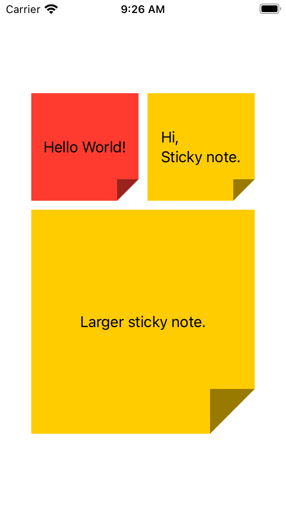

# StickyNoteView

[](https://opensource.org/licenses/MIT)
[](https://github.com/apple/swift-package-manager)



```swift
import SwiftUI
import StickyNoteView

struct ContentView: View {
    var body: some View {
        VStack {
            HStack {
                Text("Hello World!")
                    .frame(width: 120, height: 120)
                    .background(StickyNoteView(color: Color.red))
                Spacer().frame(width: 10)
                Text("Hi,\nSticky note.")
                    .frame(width: 120, height: 120)
                    .background(StickyNoteView())
            }
            
            Spacer().frame(height: 10)
            
            Text("Larger sticky note.")
                .frame(width: 250, height: 250)
                .lineLimit(10)
                .fixedSize(horizontal: true, vertical: false)
                .background(StickyNoteView())
    }
}

struct ContentView_Previews: PreviewProvider {
    static var previews: some View {
        ContentView()
    }
}
```
